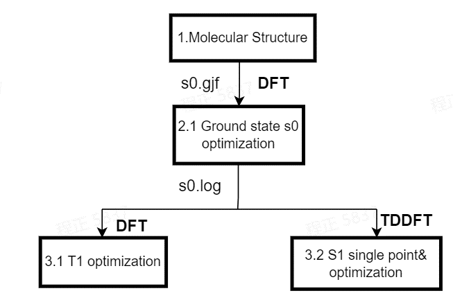

# dflow: calculate s1, t1 state energy and molecule properties (homo and lumo) of OLED molecules with Gaussian 16

## Introduction
This dflow proposal is for molecule energy and properties (homo and lumo) calculation using Gaussian 16. from preparing a gaussain 16 input of OLED molecule, structure optimization will be performed at s0 state. The structure optimizaton will be performed at s1 and t1 state using the optimized structure at s0 state as initial structures. Finally, the molecule energy, homo and lumo of optimized structure at s1 and t1 state will be collected.   

## Details

### Workflow based on dflow
However, with the aid of dflow, we only need to prepare the gaussian 16 input file which contains the structure informations, and then the remain steps are automatically. The dflow workflow diagram is shown in Figure 1.

 Figure 1. The dflow diagram for electronic calculation based VASP

### Codes 
